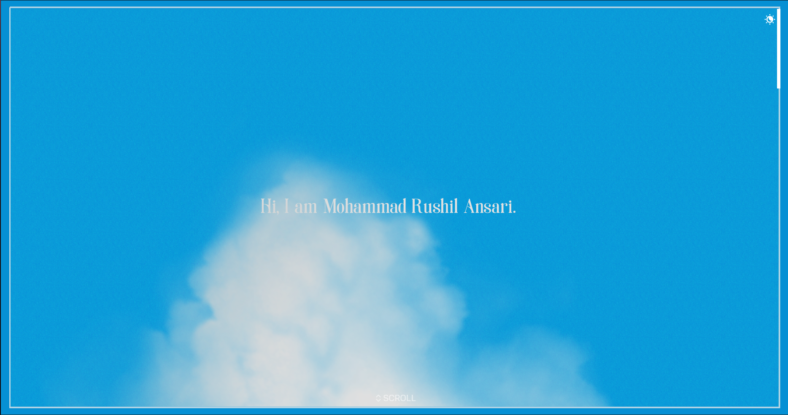
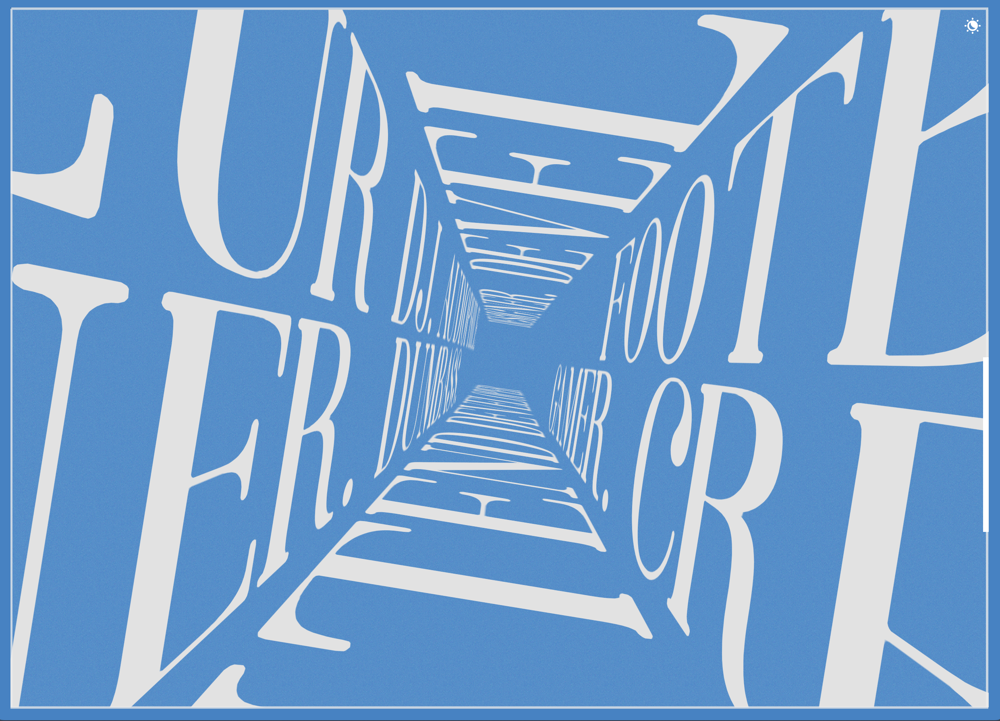
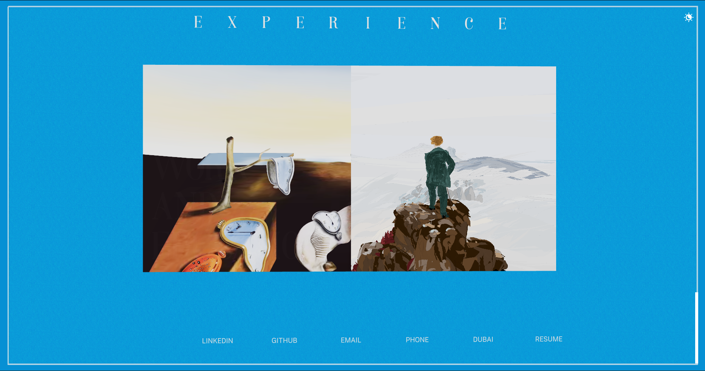
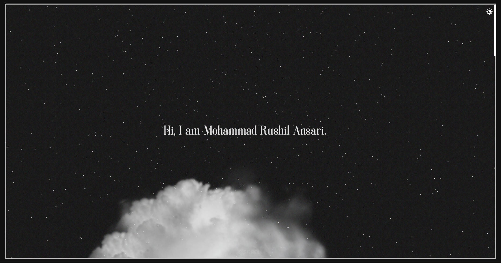

# Mohammad Rushil Ansari Portfolio

Hello there! I'm Mohammad Rushil Ansari, an Electronics and Computer Engineering student at BITS Pilani Dubai.

This is my 3D personal portfolio, curated around engineering coursework, AI, data, automation, and business systems.

Checkout the live version at [rushilansari.github.io](https://rushilansari.github.io/)

## Tech Stack

- Next.js
- React
- React-three-fiber
- DREI
- GSAP
- Zustand
- Tailwind

## Preview

Some of the sample images from the app. Better to check it out live!

